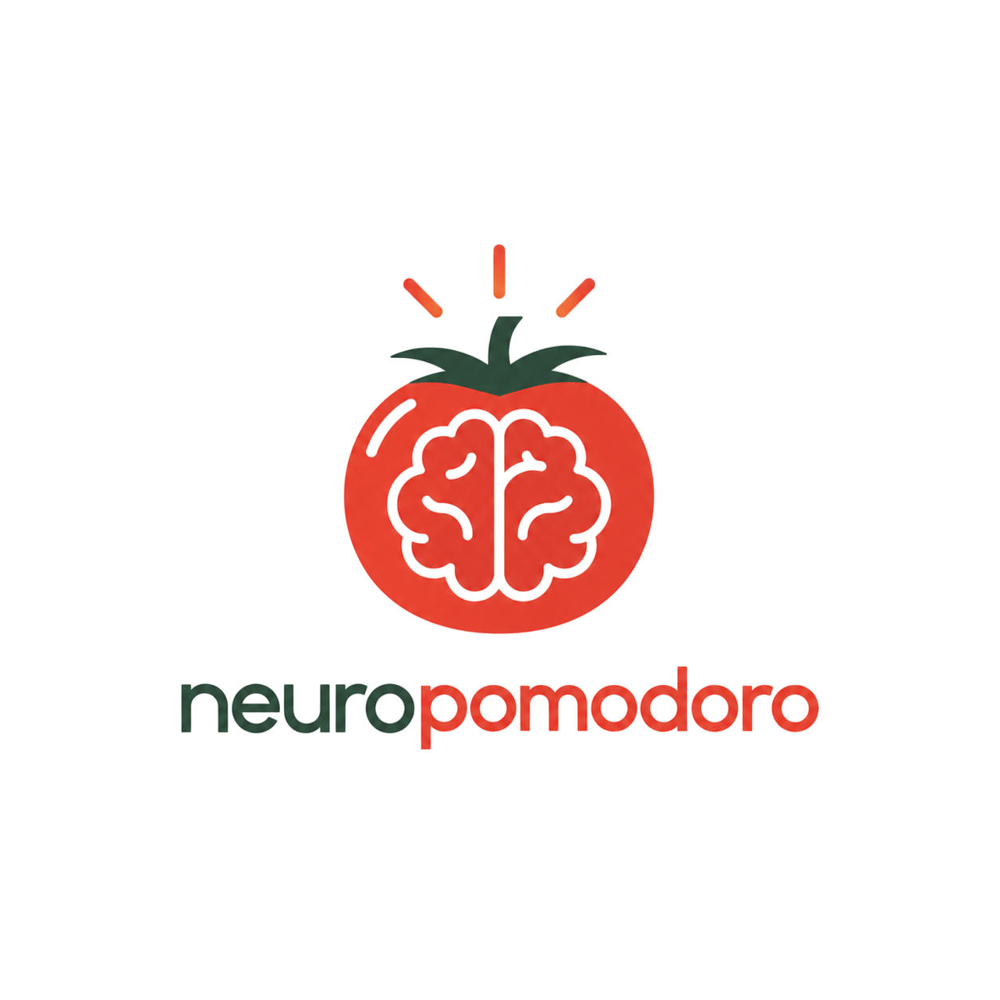
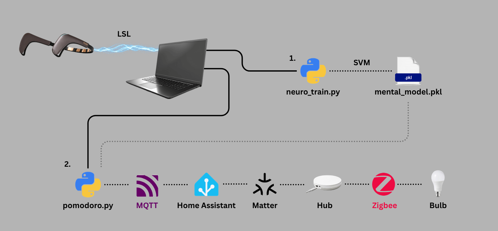
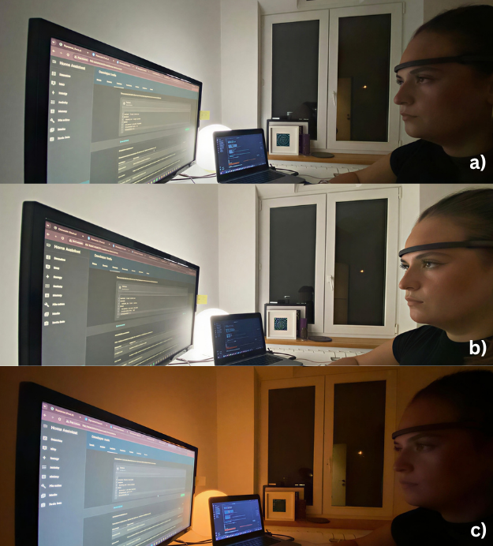
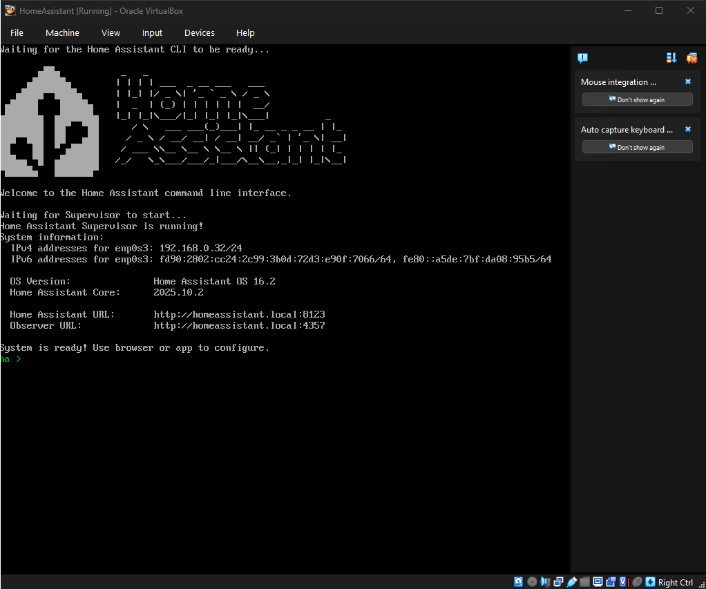
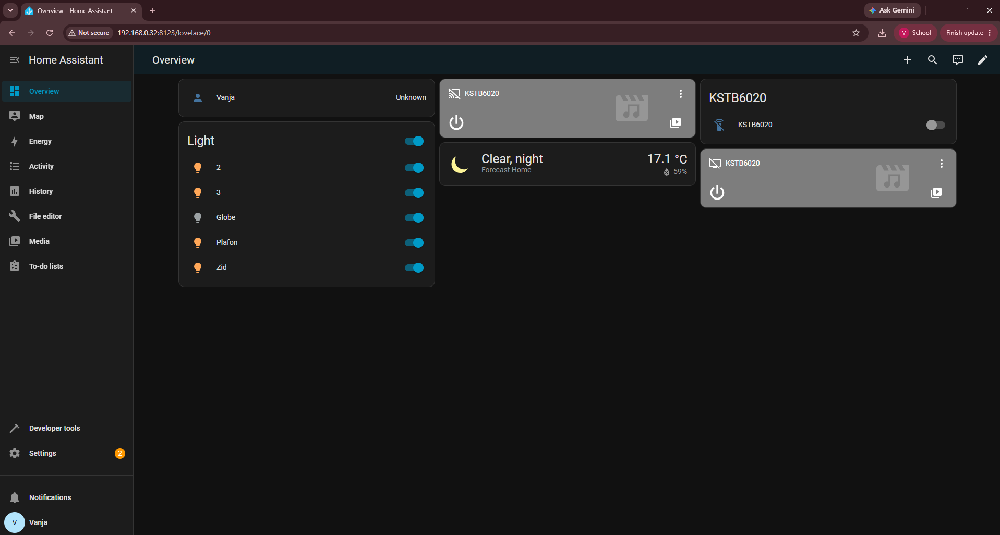

# NeuroPomodoro

A Pomodoro timer that watches your brain instead of just the clock.

A conventional Pomodoro timer cannot tell a focused 25 minutes from 25 minutes
of drifting. NeuroPomodoro reads EEG from a consumer headband, learns what
*your* work looks like against *your* resting baseline, and when your attention
lapses for long enough it brightens the light in the room. No pop-ups, no
sounds, nothing to dismiss. The feedback sits in your peripheral vision and can
be ignored, which matters for a system that is sometimes wrong.

Built as a diploma thesis at Računarski fakultet, Univerzitet Union, Belgrade.

<p align="center">
  
</p>

## How it works



**Calibration** (`neuro_train.py`) records six alternating cycles of 30s rest
and 30s work, about six minutes total. Each one-second window of EEG becomes
16 features: band power for delta, theta, alpha and beta on each of the four
channels. An SVM with an RBF kernel learns the boundary between the two classes
and is saved to disk.

**Session** (`pomodoro.py`) runs 25-minute work blocks separated by 5-minute
breaks. Every 0.2s it classifies the last second of EEG, takes the majority
vote over the last 5s, and if "rest" persists for more than 15s it brightens
the light to full. When work returns, the light drops back. At the end of the
block the light turns warm and dim for the break.

### The three light states

| State | Colour | Brightness | Meaning |
|---|---|---|---|
| Work | cool white (xy 0.313, 0.329) | 70% | working normally |
| Nudge | cool white (xy 0.313, 0.329) | 100% | resting too long, re-engage |
| Break | warm white (xy 0.507, 0.414) | 30% | break, step away |

The bulb is RGB and synthesises white from coloured LEDs, so in colour
temperature mode it only reaches 4000 K, which still looks warm. Cool white is
therefore set as a point in CIE xy space rather than as a colour temperature.



## Files

| File | What it does |
|---|---|
| `neuro_train.py` | records calibration and trains the model |
| `pomodoro.py` | runs the session and controls the light |
| `muse_stream.py` | starts the `muselsl` stream in the background and shuts it down on exit, so neither script needs a separate terminal |
| `utils.py` | feature extraction and the notch filter, from the NeuroTechX BCI workshop |

## Hardware

- **Muse 2** EEG headband (InteraXon). Four dry electrodes at TP9, AF7, AF8 and
  TP10, reference at Fpz, 256 Hz.
- **IKEA TRÅDFRI** colour and white spectrum bulb.
- **IKEA DIRIGERA** hub, which bridges Zigbee bulbs to Matter.
- A computer with Bluetooth. Windows was used here; see the notes at the end for
  other platforms.

Nothing is tied to IKEA specifically. Any colour bulb Home Assistant can control will work,
as will any EEG device that publishes an LSL stream, though the feature extraction assumes four channels.

## Software setup

### 1. Python

Python 3.9 or newer.

```bash
git clone https://github.com/vanjastankicc/neuropomodoro.git
cd neuropomodoro
pip install -r requirements.txt
```

`utils.py` and `muse_stream.py` are included in this repository, so there is
nothing else to download.

`utils.py` comes from the [NeuroTechX BCI workshop](https://github.com/NeuroTechX/bci-workshop)
(MIT licensed) and provides `compute_feature_vector`, `update_buffer` and
`get_last_data`. The only change from the original is the notch filter, set to
50 Hz for European mains:

```python
NOTCH_B, NOTCH_A = butter(4, np.array([45, 55])/(256/2), btype='bandstop')
```

**If your mains is 60 Hz**, change it back to `[55, 65]` and record your
calibration again. The model must be trained and run through the same filter.

### 2. Home Assistant

Home Assistant is distributed as its own operating system, so on Windows it
runs in a virtual machine.

1. Install **Oracle VirtualBox**.
2. Download the Home Assistant OS VirtualBox image (`.vdi`) from
   home-assistant.io and import it as a new machine.
3. Give it 2 CPU cores, 4 GB RAM and 32 GB of disk.
4. Set the network adapter to **Bridged**, not NAT. The VM needs its own
   address on your LAN so the Python script and the hub can both reach it.
5. Start the machine. The console prints a Home Assistant URL such as
http://homeassistant.local:8123, and above it an IPv4 address such as 192.168.0.31.
Take the Home Assistant URL but swap homeassistant.local for that IP address,
so http://homeassistant.local:8123 becomes http://192.168.0.31:8123.
The hostname relies on mDNS, which often fails to resolve on Windows,
while the IP address always works. Open that in a browser on the host
and create your account.



### 3. Connect the bulb

1. Pair the TRÅDFRI bulb with the DIRIGERA hub using the IKEA Home smart app.
2. In the IKEA app, enable Matter and generate a pairing code for the hub.
3. In Home Assistant, go to **Settings → Devices & Services → Add Integration**
   and add **Matter**. Accept the Matter Server add-on when prompted.
4. Enter the pairing code. Each Zigbee bulb behind the hub now appears in Home
   Assistant as its own Matter device.
5. Note the entity ID of your bulb, for example `light.globe`. You will need it
   in the automation below.



### 4. MQTT broker

1. **Settings → Add-ons → Add-on Store**, install **Mosquitto broker**, start
   it and enable "Start on boot".
2. **Settings → People → Users**, create a user for the script, for example
   `eeg`, with a password. Mosquitto authenticates against Home Assistant
   users.
3. **Settings → Devices & Services → Add Integration → MQTT**, point it at
   `core-mosquitto` on port 1883 with those credentials.

### 5. The automation

**Settings → Automations & Scenes → Create Automation → Edit in YAML**, and
paste:

```yaml
alias: EEG Light Control
triggers:
  - trigger: mqtt
    topic: eeg/light
actions:
  - action: light.turn_on
    target:
      entity_id: light.globe
    data:
      brightness_pct: "{{ trigger.payload_json.brightness_pct }}"
      xy_color: "{{ trigger.payload_json.xy_color }}"
      transition: "{{ trigger.payload_json.transition | default(1) }}"
mode: queued
max: 10
```

Change `light.globe` to your entity ID. Because the light settings travel as
fields in the message payload, adding or changing a state needs no change here,
only in the Python script.

Test it from **Developer Tools → Actions**, YAML mode:

```yaml
action: mqtt.publish
data:
  topic: eeg/light
  payload: '{"brightness_pct": 100, "xy_color": [0.313, 0.329], "transition": 1}'
```

If the bulb responds, the whole chain from MQTT to Zigbee works.

### 6. Configure the script

At the top of `pomodoro.py`:

```python
MQTT_HOST = "192.168.x.x"    # the Home Assistant VM's address
MQTT_USER = "your-username"  # e.g. eeg
MQTT_PASS = "your-password"
```

## Running it

**Put the headband on properly.** Press it firmly against your forehead and
clear hair from under the ear sensors. Contact quality matters more than
anything else here.

**Calibrate:**

```bash
python neuro_train.py
```

Six minutes, alternating. A beep marks each block.

- **Rest blocks**: sit still and let your mind wander. Eyes closed in cycles 1,
  3 and 5, open in 2, 4 and 6. The script tells you which.
- **Work blocks**: do the actual task you are about to study, reading or
  problem-solving. Eyes open.
- **Both**: no talking, no jaw clenching, minimal head movement. Movement
  artifacts can produce a good-looking model that has learned nothing.

The script prints per-cycle accuracy, the mean and the standard deviation, then
saves `mental_model.pkl`.

**Run a session:**

```bash
python pomodoro.py
```

The light turns cool white, the work block starts, and the console prints the
smoothed state. Ctrl+C stops it.

**Recalibrate every time you put the headband on.** This is not optional, see
below.

## Configuration

| Parameter | File | Default | What it does |
|---|---|---|---|
| `WORK_TIME` | pomodoro.py | 25 min | work block length |
| `BREAK_TIME` | pomodoro.py | 5 min | break length |
| `REST_TOLERANCE` | pomodoro.py | 15 s | how long rest must persist before the nudge |
| `SMOOTH_WINDOW` | pomodoro.py | 5 s | majority vote window |
| `CYCLES` | neuro_train.py | 6 | calibration cycles |
| `REST_DURATION` / `WORK_DURATION` | neuro_train.py | 30 s | block length during calibration |

`BUFFER_LENGTH`, `EPOCH_LENGTH` and `OVERLAP_LENGTH` must be identical in both
files, or the model receives features unlike the ones it was trained on.

## Results

Calibration was recorded three times, taking the headband off in between.
Leave-one-cycle-out cross-validation gave mean accuracies of **0.64, 0.73 and
0.75**, against 0.50 for chance with balanced classes. A permutation test with
shuffled labels scored exactly 0.50 (p < 0.01), so the separation is real
rather than an artifact of the overlapping windows.

No single frequency band carries the result, and delta, where head movement
shows up most, is never the best one. The most informative single channel is
TP10, behind the ear, and the two temporal channels alone reach nearly the full
accuracy. If blinks were doing the work, the frontal channels would lead. They
do not.

## Limitations

**The model does not survive putting the headband back on.** Applied to its own
recording it scores 0.87 to 0.90; applied to a recording made after re-seating
the headband it drops to 0.50 to 0.74, usually near chance. It learns where the
electrodes sat that day as much as what the two states look like. Hence the
six-minute recalibration before every session.

**Rest is recognised worse with eyes open.** Around 0.79 to 0.83 for
eyes-closed windows against 0.56 to 0.67 for eyes-open ones. During real
studying the eyes are always open, so the system operates in the regime where
the classifier is weakest.

**Roughly one estimate in four is wrong.** That is why the decision is made
over 24 consecutive windows rather than one. This is not an attention meter.

**Whether it actually helps is untested.** There is no comparison against a
plain Pomodoro timer, and no measurement of work done, fatigue, or whether the
light is experienced as helpful or annoying after prolonged use.

**The light's physiological effect is uncertain.** The bulb's spectrum was not
measured, and the classroom studies the design draws on use far brighter light
than a single household bulb. Treat the light as a signal, with a possible but
unverified physiological contribution.

## Notes

- `winsound` in `neuro_train.py` is Windows-only. On macOS or Linux, replace
  `beep()` with `print("\a")` or use the cross-platform `beep()` already in
  `utils.py`.
- Bluetooth pairing with the Muse can be temperamental. If `muselsl` cannot
  find the device, make sure it is not connected to the Muse phone app.
- `mental_model.pkl` is tied to the scikit-learn version that wrote it. Pin
  your versions or expect to retrain after an upgrade.

## Credits

- `utils.py` from the [NeuroTechX BCI workshop](https://github.com/NeuroTechX/bci-workshop)
  (Cassani & Banville), which provides the feature extraction.
- [muse-lsl](https://github.com/alexandrebarachant/muse-lsl) for streaming EEG
  from the Muse over LSL.
- [Home Assistant](https://www.home-assistant.io/) for the device layer.

Parts of both scripts were developed with the help of a large language model,
which was used for structuring the code, selecting machine learning methods and
refining the implementation. All design decisions, experimental parameters and
integration choices are the author's.

## License

MIT, see [LICENSE](LICENSE). `utils.py` is MIT licensed by NeuroTechX, see
[LICENSES/bci-workshop-LICENSE](LICENSES/bci-workshop-LICENSE).
